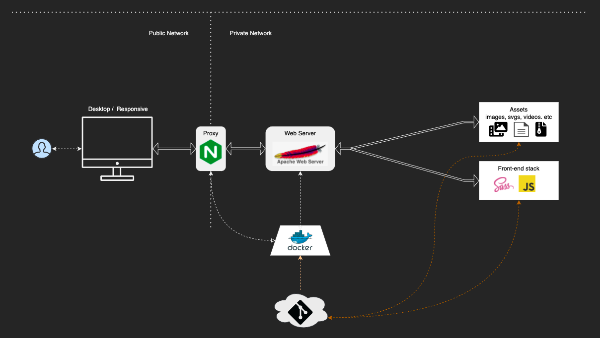

# Reverse-proxy Web-server
## Tech-stack

## How to use

- RUN `npm run install:dependencies:dev` - to install NPM dependencies
- RUN `npm run build:all:dev` - to build projects assets and FE
- RUN `npm run watch:frontend` - to start watchers for FE developemnt
- RUN `npm run build:compose` - to start docker-compose instance
- RUN `npm run stop:compose` - to stop docker-compose instances

## Architecture Diagram

</img>

## Branching Strategy

</img>
