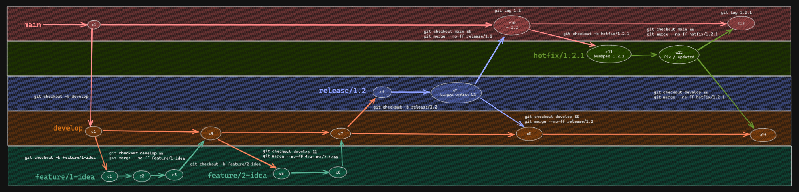

# Nginx & Httpd Template
## How to bump
- PATCH - `npm version patch` - `2.0.${patch}`
- MINOR - `npm version minor` - `2.${minor}.0`
- MAJOR - `npm version major` - `${major}.0.0`

## Architecture Diagram
</img>

## Branching Strategy
</img>
